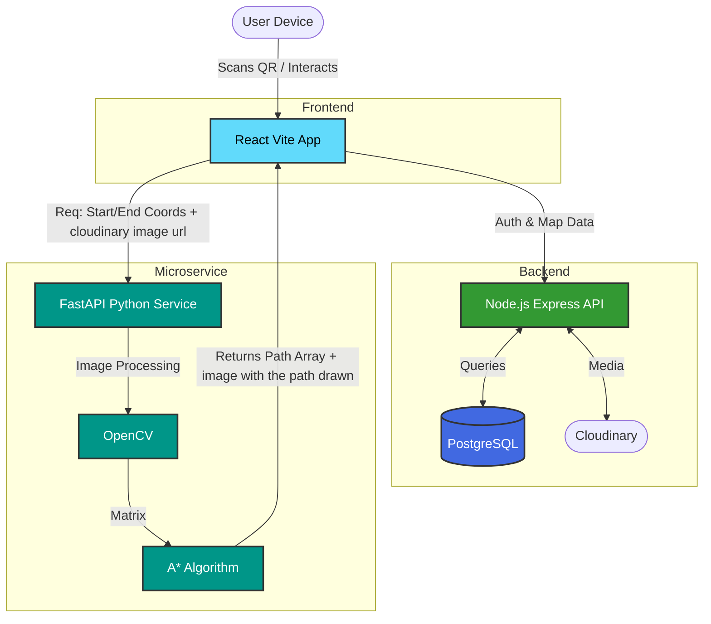

<div align="center">
  
  <h1>Map-Forge (ARNavic)</h1>
  <p><strong>A Next-Generation Augmented Reality Indoor Navigation System</strong></p>

  [](#frontend-react-application)
  [](#node-backend-express-api)
  [](#python-astar-pathfinding-microservice)
  [](#tech-stack)
</div>

<br/>

> **Map-Forge** is a comprehensive web application designed for Augmented Reality (AR) based indoor navigation. It solves the problem of unreliable indoor GPS by allowing users to upload building blueprints, scan QR codes to localize themselves, and navigate seamlessly using real-time A* pathfinding visualized in an AR environment.

---

## How We Solved It

Indoor navigation is notoriously difficult because standard GPS signals fail inside buildings. We solved this by creating a three-tier architecture that blends modern web technologies, robust image processing, and advanced algorithms:

1. **Map Digitization**: Facility managers upload building blueprints and 360° panoramas via our intuitive React dashboard. The Node.js backend processes these assets, storing them securely in Cloudinary and PostgreSQL.
2. **QR-Based Localization**: To establish a user's starting point without GPS, we generate location-specific QR codes. Users simply scan a QR code upon entering a building to load the exact floor plan and their current position.
3. **Intelligent Pathfinding**: When a user selects a destination, our Python microservice uses **OpenCV** to dynamically convert the uploaded blueprint into a traversable grid, identifying walls and obstacles. It then runs a highly optimized **A\* Pathfinding Algorithm** (enhanced with Theta* line-of-sight smoothing) to calculate the shortest, safest route.
4. **AR Navigation**: The computed path coordinates are sent back to the React frontend, which overlays the path dynamically onto the user's screen, guiding them step-by-step.

---

## Tech Stack

### Frontend (React Application)
The user interface is built for speed, interactivity, and mobile-first AR navigation.
* **Core**: React 19 (Vite), React Router for seamless navigation.
* **State Management**: Redux Toolkit for predictable state transitions.
* **Styling & UI**: Material UI (MUI), SCSS/Sass, Framer Motion for smooth animations.
* **Features**: `html5-qrcode` for scanning, `pannellum` for 360° views, `react-zoom-pan-pinch` for map interactivity.

### Node-Backend (Express API)
A robust RESTful API handling authentication, database management, and file storage.
* **Core**: Node.js, Express.js.
* **Database**: PostgreSQL (via `pg`), structured for complex relational data.
* **Authentication**: JWT (`jsonwebtoken`) & `bcryptjs` for secure password hashing.
* **Storage**: Cloudinary for fast image delivery, `multer` for multipart form parsing.

### Python-Astar (Pathfinding Microservice)
A dedicated, high-performance service specifically designed for image processing and complex routing calculations.
* **Core**: FastAPI for lightning-fast API responses.
* **Computer Vision**: OpenCV (`opencv-contrib-python`) & `imutils` for blueprint analysis and wall detection.
* **Mathematics**: NumPy for efficient grid array manipulations.

---

## System Architecture & Routing

### High-Level Architecture



### Route Definitions

<details>
<summary><strong>Frontend Routes (React Router)</strong></summary>

| Path | Purpose | Component / Description |
| :--- | :--- | :--- |
| `/` | **Home Page** | Landing dashboard |
| `/login` & `/signup` | **Authentication** | Secure user onboarding |
| `/upload` | **Upload Building Maps**| Dashboard for managers to add blueprints |
| `/all-map` | **View All Maps** | Browse available building configurations |
| `/qr` | **QR Code Scanner** | Instantly load a map based on a physical QR code |
| `/map` | **AR Navigation View** | The core AR scene rendering the A* path |

</details>

<details>
<summary><strong>Node.js Backend API</strong></summary>

| Endpoint | Method | Role |
| :--- | :---: | :--- |
| `/api/auth/signup` | `POST` | Registers a new facility manager/user |
| `/api/auth/login` | `POST` | Authenticates credentials and issues a JWT |
| `/api/buildings/upload` | `POST` | Uploads blueprints and saves metadata (Requires Auth) |
| `/api/buildings/my-buildings`| `GET` | Retrieves buildings specific to the logged-in user |
| `/api/building/:id` | `GET` | Fetches details, URLs, and metadata for a scanned QR |

</details>

<details>
<summary><strong>Python Pathfinding API</strong></summary>

**Endpoint:** `POST /navigate`

**Payload:**
```json
{
  "image_url": "https://...",
  "phone_width": 1080,
  "phone_height": 1920,
  "start": [x1, y1],
  "end": [x2, y2]
}
```

**Execution Flow:**
1. Downloads the blueprint from `image_url`.
2. Runs **OpenCV** edge detection to generate a collision matrix.
3. Executes the **A\*** algorithm to find the optimal path.
4. Returns a JSON array of `[x, y]` coordinates and a Base64 debug image.

</details>

---

## Repository Structure

```text
Map-Forge/
│
├── Frontend/                 # React application (Vite)
│   ├── src/
│   │   ├── Components/       # React components (ARScene, Auth, Home, QrScan, Upload, etc.)
│   │   ├── Redux/            # State management (Redux Toolkit)
│   │   ├── Assets/           # Images, icons, and 3D models
│   │   ├── CSS/ & SCSS/      # Styling
│   │   ├── utils/            # Helper functions
│   │   ├── App.jsx           # Main App component (wraps ARScene)
│   │   └── main.jsx          # Entry point and React Router configuration
│   ├── package.json
│   └── index.html
│
├── Node-Backend/             # Node.js + Express Backend
│   ├── config/               # Database configuration (PostgreSQL)
│   ├── controllers/          # Request handlers (auth, buildings)
│   ├── middleware/           # Custom middlewares (e.g., JWT auth)
│   ├── routes/               # API route definitions
│   ├── index.js              # Server entry point
│   └── package.json
│
└── python-astar/             # Python Pathfinding Microservice (FastAPI)
    ├── main.py               # FastAPI server and endpoint definitions
    ├── astar.py              # A* algorithm implementation and OpenCV image processing
    └── pyproject.toml
```
---

## Final Product Demonstration

Watch the system in action, demonstrating the seamless flow from scanning a QR code to following an AR-guided path:

https://github.com/user-attachments/assets/dcf9f008-6cb0-4dbc-a9e7-76da92102702

<div align="center">
  <i>Built with love by the Map-Forge Team</i>
</div>
